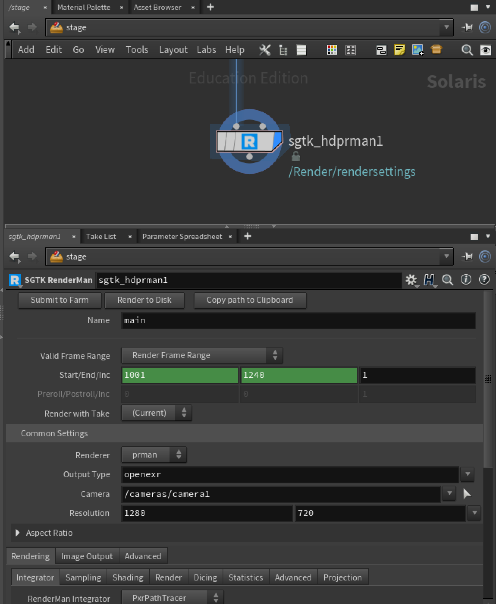
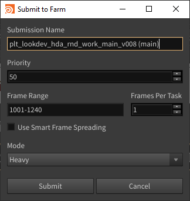

# tk-houdini-renderman
RenderMan integration for Houdini ShotGrid. Mainly written for Solaris.
## Features:
- Specify the name for the render node (default main) to specify the rendered image sequence name.
- Automatically creates paths.
- Deadline Renderfarm submissions directly from within the node (only tested on Windows) using an easy UI.
- On Solaris just click Display Filter, and all paths are automatically created. (For like a Cryptomatte)
- Support for publishing (look at tk-houdini [collector.py](https://github.com/nfa-vfxim/tk-houdini/blob/master/hooks/tk-multi-publish2/basic/collector.py))

_Solaris_
_Deadline Submission_

## Todo
- Add complete readme.md including installation instructions.
- WIP: ROP integration for RenderMan (currently working version in pre-release)
- ROP version: Add support for Display filters like Cryptomatte (already done for Solaris) 